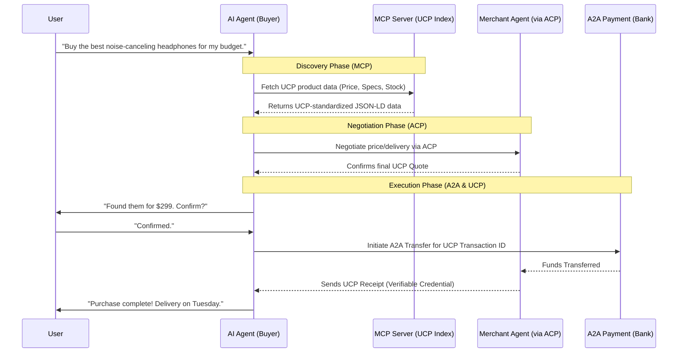

# Overview

[UCP](https://ucp.dev/) is an open-source initiative (spearheaded by Google and industry partners) designed to create a **standardized interoperability layer** for commerce on the web

**The Current Problem:** E-commerce is fragmented. Selling on Google, Amazon, or via an AI agent requires different data formats, proprietary cart APIs, and specific payment gateways.

**The UCP Solution:** It acts as a decentralized "lingua franca" for three pillars:

- **Discovery:** A universal schema for product descriptions (JSON-LD based).
- **Transaction (Universal Cart):** Allows an agent or browser to add items to a cart and checkout without leaving the current interface.
- **Identity & Payment:** Uses standards like *Verifiable Credentials* to ensure secure, identity-backed transactions.

**The "AI-Ready" Edge:** Unlike traditional APIs designed for web browsers, UCP is built for **machine readability**, allowing AI agents to understand a merchant's terms and inventory without custom integrations.

## The Integrated Ecosystem: UCP + MCP + ACP + A2A

To build a fully autonomous shopping agent, UCP acts as the "payload" or "data standard," while the others handle the communication and movement of value.

### A. UCP + MCP (Model Context Protocol)

- **The Link:** MCP (by Anthropic) connects AI models to external data sources.
- **Integration:** You build an **UCP-MCP Server**. The AI (Gemini, Claude) uses MCP to fetch structured product data from UCP-compliant endpoints.
- **Role:** MCP is the **bridge** that brings UCP data into the AI's "brain."

### B. UCP + ACP (Agent Communication Protocol)

- **The Link:** ACP defines how two AI agents talk to each other.
- **Integration:** Your "Buyer Agent" talks to a "Merchant Agent" via ACP.
- **Role:** UCP provides the **content** of the negotiation (price, SKU, shipping terms) so both agents speak the same business language.

### C. UCP + A2A (Account-to-Account Payments)

- **The Link:** A2A allows direct transfers between bank accounts (Open Banking), bypassing credit card networks.
- **Integration:** During the UCP checkout phase, the protocol triggers an A2A payment request.
- **Role:** A2A is the **settlement engine** that moves the money once the UCP transaction is validated.

## Transaction Flow Schema

Below is the conceptual flow of an AI-driven purchase using the full stack:

## Summary Table

| **Protocol** | **Function** | **Analogy** |
| --- | --- | --- |
| **UCP** | Product & Cart Data Standard | The Catalog & Order Form |
| **MCP** | AI-to-Data Connection | The Cable connecting the AI to the store |
| **ACP** | Agent-to-Agent Dialogue | The Phone call between buyer and seller |
| **A2A** | Value Transfer | The direct Wire Transfer |

### Next

[Reference: AI / Protocols](Reference%20AI%20Protocols%202631ec0b77e080c1a2c0cc2674e1d75f.md)
